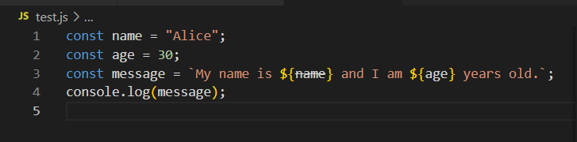
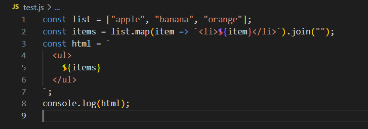
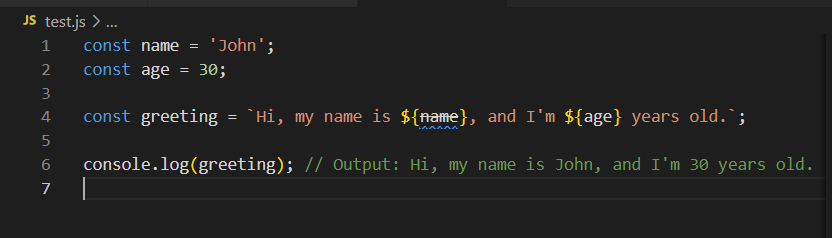
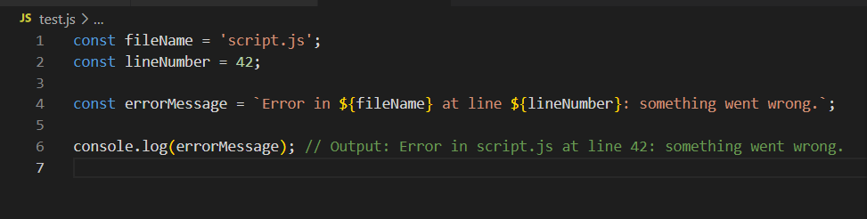

# String Template 

## Pengertian

Templat string adalah fitur dalam bahasa pemrograman yang memungkinkan Anda menentukan string dengan placeholder yang dapat diganti dengan nilai saat runtime. Template string menyediakan cara mudah untuk membuat string yang menggabungkan teks tetap dengan data dinamis, seperti input pengguna atau hasil perhitungan. Di sebagian besar bahasa pemrograman, templat string ditentukan menggunakan sintaks khusus yang menunjukkan lokasi placeholder. 

## Contoh kode program template string 
Berikut adalah contoh penggunaan templat string dengan ES6:  
Di JavaScript, ES6 memperkenalkan fitur baru yang disebut "template literal" yang menyediakan cara mudah untuk membuat template string. Berikut adalah contoh kode untuk menggunakan template string dengan ES6:

Dalam contoh ini, fungsi backticks ( ) are used to define the string template, and the placeholders are indicated using the ${} syntax. The variablesname andage are then inserted into the placeholders when the string is evaluated. The resulting string will be "My name is Alice and I am 30 years old.", which is then printed to the console using theconsole.log()`.

Template string juga dapat digunakan untuk membuat string yang lebih kompleks dengan menyertakan ekspresi dan string multiline. Berikut adalah contoh yang menggunakan templat string untuk membuat string multibaris:

## Contoh penggunaan string template yang benar
1. Membuat kalimat sapaan dengan menyertakan variabel nama dan usia:

2. Membuat URL API dengan menyertakan variabel endpoint dan API key:

3. Membuat pesan error dengan menyertakan variabel nama file dan nomor baris:

Pada contoh-contoh di atas, template string digunakan untuk menggabungkan string dengan variabel secara lebih mudah dan efisien. Dengan menggunakan template string, kita dapat memasukkan variabel ke dalam string dengan lebih jelas dan mudah dibaca.

